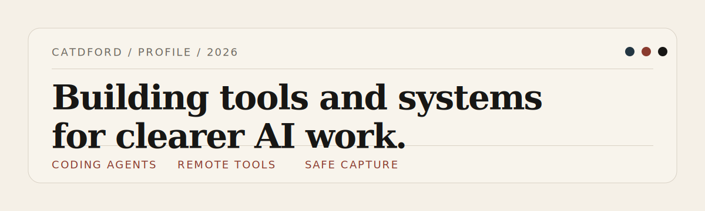
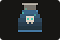
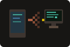
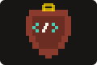

  

### catDforD

AI coding agent researcher & builder — Zhejiang University

 

### Featured Projects

<table>
  <tr>
    <td align="center" valign="top" width="33%">
      <a href="https://github.com/catDforD/coding-agent-lab">
         
        <strong>coding-agent-lab</strong>
      </a>
    </td>
    <td align="center" valign="top" width="33%">
      <a href="https://github.com/catDforD/VibeLink">
         
        <strong>VibeLink</strong>
      </a>
    </td>
    <td align="center" valign="top" width="33%">
      <a href="https://github.com/catDforD/opencode_safe">
         
        <strong>opencode_safe</strong>
      </a>
    </td>
  </tr>
  <tr>
    <td align="center" valign="top">
      Study, reproduce & compare coding agents
    </td>
    <td align="center" valign="top">
      Connect your vibe coding environment, anywhere
    </td>
    <td align="center" valign="top">
      Container-supervised safety for coding agents
    </td>
  </tr>
  <tr>
    <td align="center" valign="top">
      
    </td>
    <td align="center" valign="top">
      
    </td>
    <td align="center" valign="top">
      
    </td>
  </tr>
</table>

> Also building: [Polyphony](https://github.com/catDforD/Polyphony) · [ZhaoXi](https://github.com/catDforD/ZhaoXi) · [skills](https://github.com/catDforD/skills)

 

### Current Focus

Exploring how coding agents plan, remember, and use tools — and building interfaces that make long-running AI sessions observable and trustworthy.

 

### Tech & Tools

  
  
  
  
  
  

 

---

[GitHub](https://github.com/catDforD) · [Email](mailto:3276453835@qq.com)

*Turning messy processes into systems people can trust.*

