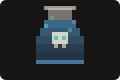
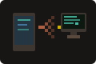
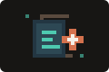

<picture>
  <source media="(max-width: 600px)" srcset="./assets/profile/hero-banner-mobile.svg">
  
</picture>

  <a href="#about-me--关于我">About</a> ·
  <a href="#selected-projects--项目精选">Projects</a> ·
  <a href="#toolbox--技术栈">Toolbox</a> ·
  <a href="mailto:3276453835@qq.com">Email ↗</a>

## About me · 关于我

**Hi, I'm catDforD.** A student at Zhejiang University, exploring how coding agents work and building tools around them.

你好，我是 catDforD，就读于浙江大学。喜欢拆解 AI 编程工具，也喜欢把想法做成能用的东西。

- **Research / 研究** — Agent 的规划、记忆与工具调用，从阅读实现到最小复现。
- **Build / 构建** — 编程助手的交互与工作流，让长时间运行的任务更容易观察和控制。
- **Share / 分享** — 把研究笔记、实验代码和日常工具整理成开源项目。

## Selected projects · 项目精选

从理解 Agent，到连接工作流，再到扩展它的能力。

<table width="100%">
  <tr>
    <td align="center" width="160">
      
    </td>
    <td width="720">
      <strong><a href="https://github.com/catDforD/coding-agent-lab">coding-agent-lab ↗</a></strong> · <code>Python</code> 
      学习、拆解、复现和比较 coding agents。 
      A lab for understanding how coding agents work.
    </td>
  </tr>
  <tr>
    <td align="center" width="160">
      
    </td>
    <td width="720">
      <strong><a href="https://github.com/catDforD/VibeLink">VibeLink ↗</a></strong> · <code>Dart</code> <code>Flutter</code> 
      从手机连接 AI 编程终端，查看任务、管理会话。 
      Your AI coding terminal, wherever you are.
    </td>
  </tr>
  <tr>
    <td align="center" width="160">
      
    </td>
    <td width="720">
      <strong><a href="https://github.com/catDforD/skills">skills ↗</a></strong> · <code>Python</code> 
      为编程助手整理可复用的技能与日常工具。 
      Reusable skills for everyday agent workflows.
    </td>
  </tr>
</table>

**Also building** · [Polyphony](https://github.com/catDforD/Polyphony) / [ZhaoXi](https://github.com/catDforD/ZhaoXi) / [All repositories ↗](https://github.com/catDforD?tab=repositories)

## Toolbox · 技术栈

- **Languages** · `Python` `TypeScript` `Dart`
- **App & UI** · `React` `Flutter`
- **Environment** · `Docker` `Linux`

## Let's connect · 交流

欢迎交流 coding agents、开发工具和有意思的开源项目。

[Email ↗](mailto:3276453835@qq.com) &nbsp; · &nbsp; [GitHub ↗](https://github.com/catDforD)

---

Understand the agent. Build the tools. Share what works.

