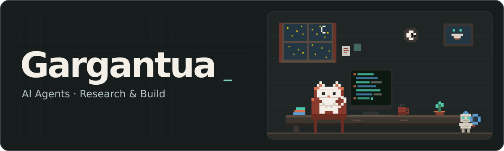

<picture>
  <source media="(max-width: 600px)" srcset="./assets/profile/hero-banner-mobile.svg">
  
</picture>

  <a href="#about-me--关于我">About</a> ·
  <a href="#toolbox--技术栈">Toolbox</a> ·
  <a href="https://catdfd.com/">Website</a> ·
  <a href="mailto:3276453835@qq.com">Email</a>

## About me · 关于我

**Hi, I'm Gargantua.** A student at Zhejiang University, exploring how coding agents work and building tools around them.

你好，我是 Gargantua，就读于浙江大学。喜欢拆解 AI 编程工具，也喜欢把想法做成能用的东西。

- 🔬 **Research / 研究** — Agent 的规划、记忆与工具调用，从阅读实现到最小复现。
- 🛠️ **Build / 构建** — 编程助手的交互与工作流，让长时间运行的任务更容易观察和控制。
- 📝 **Share / 分享** — 把研究笔记、实验代码和日常工具整理成开源项目。

## Toolbox · 技术栈

- 💻 **语言 / Languages** · `Python` `Rust`
- 🧰 **常用技术栈 / Stack** · `React` `FastAPI` `Docker` `Linux` `MCP` `Inspect AI` `Claude Code` `Codex` `OpenSpec`
- 🎯 **方向 / Focus** · `Agent 开发` `多智能体系统` `AI 安全与评测` `开发工具` `AI 协作开发`

## Let's connect · 交流

欢迎交流开发工具和有意思的开源项目。

[个人主页 · catdfd.com ↗](https://catdfd.com/) &nbsp; · &nbsp; [Email ↗](mailto:3276453835@qq.com) &nbsp; · &nbsp; [GitHub ↗](https://github.com/catDforD)

---

Understand the agent. Build the tools. Share what works.

